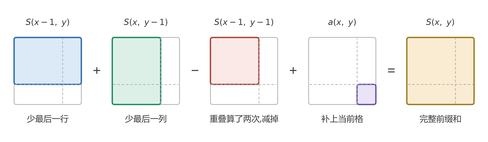
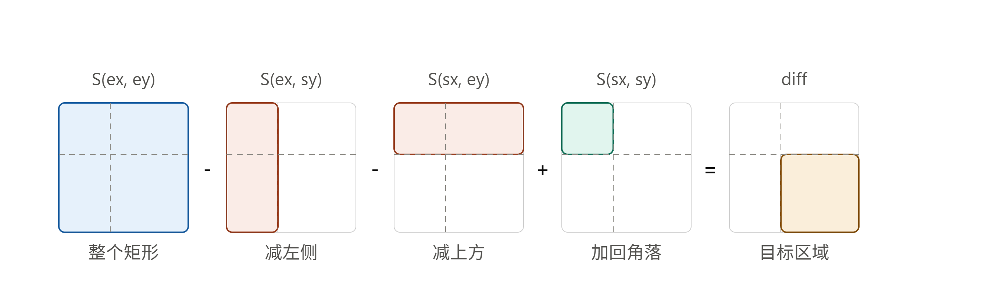
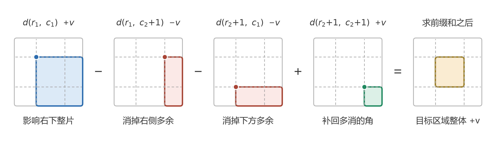

# 二维前缀和 / 2D Prefix Sum

> **一句话 / TL;DR**:O(mn) 预处理出「左上角到 (x,y) 的矩形和」,之后任意子矩形的和都能靠**四点容斥**在 O(1) 查出来;逆运算(二维差分)则把「区域整体加值」变成 O(1) 的四点打点。

## 何时用 / When to use

触发信号(看到这些就该想到本模式):

- **多次查询**子矩形/子数组的和(矩阵不变,查询很多)
- 「和为 K 的子矩阵/子数组」这类需要枚举区域和的题
- **多次对矩形区域整体加减**,最后才问结果 → 二维差分
- 暴力的特征:每次查询都 O(mn) 重新累加,总复杂度 O(q·mn)

## 核心思想 / Core idea

记 `S(x, y)` 为以 (0,0) 和 (x,y) 为对角的矩形内所有元素之和(约定 x=行、y=列)。核心只有一件事:**矩形区域不重不漏地拼起来,重叠部分用容斥修正**。建表和查询是同一个思想的两个方向:

**建表**:大矩形 = 上面的 + 左边的 − 重叠的左上块 + 当前格:



**查询**:任意子矩形 = 整个大矩形 − 左侧竖条 − 上方横条 + 被减两次的左上角:



图中 `(sx, sy)` 是目标区域**左上角的前一行/列**、`(ex, ey)` 是右下角本身——对应下面代码里 padded 数组的 `p[r1][c1]` 与 `p[r2+1][c2+1]`。

**二维差分(逆运算)**:要给区域 (r₁,c₁)~(r₂,c₂) 整体 +v,不去逐格改,而是在差分数组 d 上打 4 个点——一次打点经过前缀和会扩散到它**右下方的整片**,四片一容斥恰好只剩目标区域:



## 模板代码 / Template

```python
def build(matrix):
    """padded 建表:p 比 matrix 各多一行一列 0,彻底消灭边界判断"""
    m, n = len(matrix), len(matrix[0])
    p = [[0] * (n + 1) for _ in range(m + 1)]
    for i in range(1, m + 1):           # 从 1 开始!见易错点
        for j in range(1, n + 1):
            p[i][j] = p[i-1][j] + p[i][j-1] - p[i-1][j-1] + matrix[i-1][j-1]
    return p

def query(p, r1, c1, r2, c2):
    """闭区间 [r1,c1]~[r2,c2] 的和,四点容斥"""
    return p[r2+1][c2+1] - p[r1][c2+1] - p[r2+1][c1] + p[r1][c1]
```

```python
def range_add(d, r1, c1, r2, c2, v):
    """二维差分:d 是 (m+1)×(n+1) 的零阵,区域整体 +v 只打 4 个点。
    所有更新做完后,对 d 求一遍二维前缀和即得最终矩阵。"""
    d[r1][c1]     += v
    d[r1][c2+1]   -= v
    d[r2+1][c1]   -= v
    d[r2+1][c2+1] += v
```

## 变体 / Variants

| 变体 | 关键区别 | 典型题 |
|---|---|---|
| 一维前缀和 + 哈希 | 「和为 K 的子数组」:枚举右端点,查 `pre - k` 出现过几次 | 560 |
| 二维静态查询 | 建表一次,O(1) 查任意子矩形 | 304, 1314 |
| 和为目标的子矩阵 | 固定上下行边界压成一维,套 560 的哈希套路 | 1074 |
| 二维差分 | 前缀和的逆:区域批量加 → 四点打点 → 最后求一遍前缀和 | 2536 |
| 前缀异或/前缀积 | 把「加法」换成任意可逆运算 | 1310 |

## 易错点 / Pitfalls

- **建表循环要从 1 开始**。我在 304 里从 `i=0` 写起,`p[i-1]`、`matrix[i-1]` 靠 Python 负下标回绕到最后一行/列,把矩阵末行末列的累加和污染进了 p 的第 0 行/列——居然还 AC 了,因为污染恰好是「行函数 + 列函数」的可分形式,在查询的双重差分里完全抵消。**纯属侥幸**,换个语言或换种查询方式立刻爆炸。
- 查询用的是 `r2+1`、`c2+1`(padded 下标),别和闭区间端点混用;记忆方法:**减去的两项各带一个原始端点 r1/c1,加回的角是 (r1, c1)**。
- 容斥符号想不清时回看图:减了两条就必然要**加回一次**重叠角,和图中红/绿的角色一一对应。
- 二维差分打点在 `c2+1`、`r2+1` 处,所以 d 要开 **(m+1)×(n+1)**,否则右边界/下边界越界。
- 元素有正有负时,前缀和**不单调**,不能配二分/滑窗,只能配哈希(560 的坑)。

## 案例 / Problems

> 活表:每刷一题加一行。

| # | 题目 | 难度 | 一句话考点 | 我的解法 |
|---|---|---|---|---|
| 304 | Range Sum Query 2D - Immutable | Med | padded 建表 + 四点容斥查询 | [code](../../0304-range-sum-query-2d-immutable/) |
| 427 | Construct Quad Tree | Med | 区域和 = 0 或 = 面积 ⇒ 纯色,O(1) 剪枝分治 | [code](../../0427-construct-quad-tree/) |
| 560 | Subarray Sum Equals K | Med | 一维前缀和 + 哈希计数 | [code](../../0560-subarray-sum-equals-k/) |

## 关联 / Related

- 对比 [滑动窗口](./sliding-window.md):窗口要求元素非负(单调性),前缀和 + 哈希没有这个限制
- 差分是前缀和的**逆运算**,一维版本常与 [扫描线](./sweep-line.md) 互换使用

<!-- 标签便于检索: #pattern #prefix-sum #matrix -->
